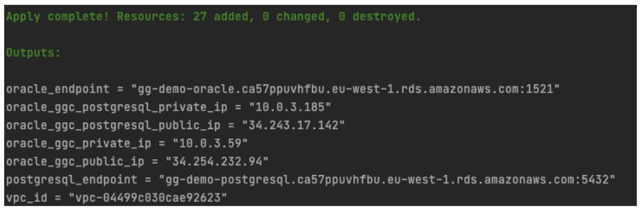

# Replicación de cambios unidireccional con Oracle GoldenGate

Repositorio correspondiente al post de replicación unidireccional con GoldenGate.

# Requisitos

Para poder ejecutar este ejemplo necesitas;

- Docker
- Credenciales de consola de un usuario de AWS con permiso para manejar EC2, RDS Oracle, MSK, VPC, Security Groups

# Creando la infraestructura base

## Infraestructura en AWS

Para facilitar la “puesta en escena” del caso de uso vamos a usar los servicios de bases de datos gestionadas (RDS) para disponer de una base de datos Oracle y una base de datos Postgresql. 

La base de datos Oracle, en un caso real, podría estar en un entorno on-premise. En el caso de uso, sí se comenta que uno de los objetivos es ir a una base de datos en Cloud y autogestionada.

En este caso de ejemplo, como queremos facilitar la conexión a los diferentes elementos directamente desde el PC local, hemos definido una VPC con una única subred pública y dotaremos a las bases de datos de acceso público. En un sistema productivo, usaríamos redes privadas. 

A continuación vamos a detallar los pasos a seguir


### Generando la clave SSH

El script de Terraform necesita un par de claves para crear las instancias EC2 y nosotros usaremos la clave SSH posteriomente para conectarnos a las instancias. 

Por tanto, antes de lanzar el script de Terraform vamos a generar un par de claves ejecutando el siguiente comando desde la raíz del proyecto:

```bash
ssh-keygen -q -N "" -f iac/ssh/ssh_gg
```

Dentro del directorio “iac/ssh” se crearán dos ficheros correspondientes a las claves pública y privada.


### Creando la infraestructura con Terraform

Para ejecutar las acciones de creación y destrucción de la infraestructura nos vamos a apoyar en una imagen Docker que contiene Terraform y todo lo necesario para levantar la infraestructura. Solo necesitaremos las credenciales de AWS

El primer paso es construir la imagen a partir del Dockerfile. Para ello, desde la raíz del proyecto, lanzamos:

```bash
docker build . -t ogg_infra_builder
```

Después, lanzamos el contenedor y accedemos a él con el comando:

```
docker run -it --rm -e KEY_ID=<AWS_USER_KEY_ID> -e SECRET_ID=<AWS_SECRET_KEY_ID> -v $(pwd)/iac:/root/iac --entrypoint /bin/bash ogg_infra_builder
```

reemplazando 

- AWS_USER_KEY_ID: valor de la KEY del usuario de AWS
- AWS_SECRET_KEY_ID: valor de la SECRET del usuario de AWS

Después, ejecutamos dentro del contenedor el comando:

```
sh build.sh
```


Una vez ejecutado el script y creada la infraestructura, tendremos todo lo necesario para implementar el proceso de replicación. Como salida del script de Terraform, obtendremos algo parecido a lo siguiente:




## Creando el modelo de datos inicial en Oracle

Una vez que tenemos la infraestructura creada y levantada, vamos a crear el modelo de datos en Oracle para poder partir del escenario inicial planteado en el caso de uso. Para conectarse a la base de datos podemos usar cualquier cliente compatible. Los datos de conexión son los siguientes:

- **Host**: valor de la variable de salida de Terraform "oracle_endpoint"
- **SID**: ggdemo
- **User/Passw**: oracledb / oracledb

Nos conectamos a la base de datos con nuestro cliente y lanzamos el siguiente script de SQL:

```sql
CREATE TABLE CUSTOMERS 
(
  ID NUMBER NOT NULL, 
  NIF VARCHAR2(9) NULL,
  CIF VARCHAR2(9) NULL,
  EMAIL VARCHAR2(255) NULL, 
  TELEFONO VARCHAR2(20) NOT NULL, 
  NOMBRE VARCHAR2(255) NULL,
  RAZONSOCIAL VARCHAR2(255) NULL,
  DESCRIPCION VARCHAR2(255) NULL,
  TIPO INTEGER NOT NULL,
  REPRESENTANTE VARCHAR2(255) NULL,
  CONSTRAINT CUSTOMERS_PK PRIMARY KEY (ID) ENABLE 
);

CREATE SEQUENCE CUSTOMERS_SEQ;

CREATE TRIGGER CUSTOMERS_TRG 
BEFORE INSERT ON CUSTOMERS 
FOR EACH ROW 
BEGIN
  <<COLUMN_SEQUENCES>>
  BEGIN
    IF INSERTING AND :NEW.ID IS NULL THEN
      SELECT CUSTOMERS_SEQ.NEXTVAL INTO :NEW.ID FROM SYS.DUAL;
    END IF;
  END COLUMN_SEQUENCES;
END;
/

INSERT INTO CUSTOMERS (NIF, EMAIL, TELEFONO, NOMBRE, TIPO) VALUES ('11111111H', 'test1@email.com', '111111111', 'test1', 1);
INSERT INTO CUSTOMERS (NIF, EMAIL, TELEFONO, NOMBRE, TIPO) VALUES ('22222222H', 'test2@email.com', '222222222', 'test2', 1);
INSERT INTO CUSTOMERS (NIF, EMAIL, TELEFONO, NOMBRE, TIPO) VALUES ('33333333H', 'test3@email.com', '333333333', 'test3', 1);
INSERT INTO CUSTOMERS (NIF, EMAIL, TELEFONO, NOMBRE, TIPO) VALUES ('44444444H', 'test4@email.com', '444444444', 'test4', 1);
INSERT INTO CUSTOMERS (NIF, EMAIL, TELEFONO, NOMBRE, TIPO) VALUES ('55555555H', 'test5@email.com', '555555555', 'test5', 1);
INSERT INTO CUSTOMERS (CIF, EMAIL, TELEFONO, RAZONSOCIAL, TIPO) VALUES ('B76365789', 'test6@email.com', '666666666', 'Empresa 1', 2);
INSERT INTO CUSTOMERS (CIF, EMAIL, TELEFONO, RAZONSOCIAL, TIPO) VALUES ('C76462739', 'test7@email.com', '777777777', 'Empresa 2', 2);
INSERT INTO CUSTOMERS (CIF, EMAIL, TELEFONO, RAZONSOCIAL, TIPO) VALUES ('J73422331', 'test8@email.com', '888888888', 'Empresa 3', 2);
COMMIT;
```


# Preparando la base de datos Oracle para replicación

Para que el proceso de replicación sea posible necesitamos configurar la base de datos Oracle. Para ello, lanzamos las siguientes sentencias SQL:

```
ALTER TABLE CUSTOMERS ADD SUPPLEMENTAL LOG DATA (ALL) COLUMNS;

exec rdsadmin.rdsadmin_util.set_configuration('archivelog retention hours',24);

CREATE TABLESPACE administrator;
CREATE USER oggadm1 IDENTIFIED BY "oggadm1" DEFAULT TABLESPACE ADMINISTRATOR TEMPORARY TABLESPACE TEMP;
alter user oggadm1 quota unlimited on ADMINISTRATOR;
GRANT UNLIMITED TABLESPACE TO oggadm1;


GRANT CREATE SESSION, ALTER SESSION TO oggadm1;
GRANT RESOURCE TO oggadm1;
GRANT SELECT ANY DICTIONARY TO oggadm1;
GRANT FLASHBACK ANY TABLE TO oggadm1;
GRANT SELECT ANY TABLE TO oggadm1;
GRANT INSERT ANY TABLE TO oggadm1;
GRANT UPDATE ANY TABLE TO oggadm1;
GRANT DELETE ANY TABLE TO oggadm1;
GRANT CREATE ANY TABLE TO oggadm1;
GRANT ALTER ANY TABLE TO oggadm1;
GRANT LOCK ANY TABLE TO oggadm1;

GRANT SELECT_CATALOG_ROLE TO oggadm1 WITH ADMIN OPTION;
GRANT EXECUTE ON DBMS_FLASHBACK TO oggadm1;
GRANT SELECT ON SYS.V_$DATABASE TO oggadm1;
GRANT ALTER ANY TABLE TO oggadm1;
GRANT CREATE CLUSTER TO oggadm1;
GRANT CREATE INDEXTYPE      TO oggadm1;
GRANT CREATE OPERATOR       TO oggadm1;
GRANT CREATE PROCEDURE      TO oggadm1;
GRANT CREATE SEQUENCE       TO oggadm1;
GRANT CREATE TABLE          TO oggadm1;
GRANT CREATE TRIGGER        TO oggadm1;
GRANT CREATE TYPE           TO oggadm1;

exec rdsadmin.rdsadmin_util.grant_sys_object ('DBA_CLUSTERS', 'OGGADM1');
exec rdsadmin.rdsadmin_dbms_goldengate_auth.grant_admin_privilege (grantee=>'OGGADM1', privilege_type=>'capture', grant_select_privileges=>true, do_grants=>TRUE);
exec rdsadmin.rdsadmin_util.force_logging(p_enable => true);
exec rdsadmin.rdsadmin_util.alter_supplemental_logging('ADD','PRIMARY KEY');
```

> **ATENCIÓN:** El script está preparado para ser lanzado en una base de datos AWS RDS Oracle, que es la que utilizamos en este ejemplo. De ahí las sentencias del tipo “exec rdsadmin.“


# Instalando Oracle GoldenGate Classic

## Ficheros necesarios

- **Distribución de Oracle GoldenGate Classic**
  Debes descargar la release de Oracle GoldenGate Classic desde la [página oficial de Oracle](https://www.oracle.com/es/middleware/technologies/goldengate-downloads.html). 

  Selecciona la versión “[Oracle GoldenGate 19.1.0.0.4 for Oracle on Linux x86-64](https://www.oracle.com/es/middleware/technologies/goldengate-downloads.html#license-lightbox)“
  Una vez descargado, lo tenemos que copiar en la máquina EC2 destinada a contener Oracle GoldenGate Classic. 

  

- **Distribución de Oracle Instant Client**
  Debes descargar la release de Oracle Instant Client desde la [página oficial de Oracle](https://download.oracle.com/otn_software/linux/instantclient/1911000/instantclient-basic-linux.x64-19.11.0.0.0dbru.zip). A continuación cópialo a la máquina EC2 que va a ejecutar Oracle GoldenGate Classic 


## Instalación y configuración de Oracle GoldenGate Classic

### Instalando el producto

Una vez copiados los ficheros, nos conectamos a la máquina por SSH (en la salida del script de Terraform, aparece como “oracle_ggc_public_ip”).

> Al ser instancias de EC2 basadas en RHEL, el usuario es “ec2-user”. La clave SSH se encuentra en el repositorio (“iac/ssh/ssh_gg”)

Creamos los siguientes directorios:

```bash
mkdir /home/ec2-user/ggc-install
mkdir /home/ec2-user/ggc
mkdir /home/ec2-user/oraInventory
mkdir /home/ec2-user/oracle_instant_client_19c
mkdir /home/ec2-user/tnsnames
```

A continuación, procedemos a instalar el cliente de base de datos **Oracle Instant Client**. Para ello, lanzamos:

```bash
cd /home/ec2-user/oracle_instant_client_19c
unzip -j /tmp/instantclient-basic-linux.x64-19.11.0.0.0dbru.zip
```

Ahora vamos a extraer el ZIP de **Oracle GoldenGate Classic** para poder instalarlo;

```bash
cd /home/ec2-user/ggc-install
unzip /tmp/191004_fbo_ggs_Linux_x64_shiphome.zip
```

Como vamos a realizar la instalación en modo silencioso para no tener que instalar el entorno gráfico en la máquina EC2, debemos crear un fichero *.rsp* que contiene los parámetros necesarios para la instalación. Lanzamos:

```bash
vi /home/ec2-user/ggc-install/ggc-install.rsp
```

Y copiamos lo siguiente:

```bash
oracle.install.responseFileVersion=/oracle/install/rspfmt_ogginstall_response_schema_v19_1_0
INSTALL_OPTION=ORA19c
SOFTWARE_LOCATION=/home/ec2-user/ggc
INVENTORY_LOCATION=/home/ec2-user/oraInventory
UNIX_GROUP_NAME=ec2-user
```

Una vez que hemos creado el fichero ".rsp", procedemos a ejecutar la instalación:

```bash
cd /home/ec2-user/ggc-install/fbo_ggs_Linux_x64_shiphome/Disk1/
./runInstaller -silent -showProgress -waitforcompletion -responseFile /home/ec2-user/ggc-install/ggc-install.rsp
```

Cuando el proceso de instalación finalice, creamos la siguiente variable de entorno:

```bash
export LD_LIBRARY_PATH=/home/ec2-user/oracle_instant_client_19c
```


### Configurando el acceso a base de datos

Para que Oracle GoldenGate Classic pueda acceder a la base de datos Oracle es necesario configurar la conexión. Esto se realiza mediante el fichero "*tnsnames.ora*". Para ello, creamos el fichero “tnsnames.ora” en el directorio “/home/ec2-user/tnsnames”:

```bash
vi /home/ec2-user/tnsnames/tnsnames.ora
```

E incluimos las siguientes líneas:

```bash
ORARDS =
  (DESCRIPTION =
    (ADDRESS = (PROTOCOL = TCP)(HOST = #ORACLE_RDS_ENDPOINT#)(PORT = 1521))
    (CONNECT_DATA =
      (SID = ggdemo)
    )
  )
```

Sustituyendo #ORACLE_RDS_ENDPOINT# por el valor correspondiente a la base de datos Oracle creada. Como se ha comentado anteriormente, el valor se puede consultar en la consola de AWS o de la salida del script de Terraform, en la clave “oracle_endpoint”

Por último, hay que definir la variable de entorno TNS_ADMIN:

```bash
export TNS_ADMIN=/home/ec2-user/tnsnames
```


### Creando la estructura inicial de directorios para GoldenGate Classic

Una vez que hemos terminado la instalación como tal, vamos a ejecutar el intérprete de comandos de Oracle GoldenGate, GGSCI. Para ello, nos conectamos a la máquina de nuevo y ejecutamos:

```bash
cd /home/ec2-user/ggc
./ggsci
```

Y se abrirá el cliente de Oracle GoldenGate para que podamos ejecutar comandos sobre él. El primer comando será el que genere la estructura inicial de directorios:

```bash
CREATE SUBDIRS
```

Como resultado se generarán todos los directorios que Oracle GoldenGate necesita.


### Creando el almacén de credenciales

En Oracle GoldenGate podemos definir un almacén de credenciales para asociar un alias a los datos de conexión a la base de datos (usuario / password) y, hacer referencia al alias en los procesos de extracción o replicación. Para crear el almacén de credenciales, entramos en GGSCI y ejecutamos:

```bash
add credentialstore
```


Después, añadimos los datos referentes a la conexión que hemos definido anteriormente en el fichero *tnsnames.ora*:

```
alter credentialstore add user oggadm1@ORARDS, password oggadm1, alias orards 
```


### Inicializando el componente Manager

El Manager es un componente principal de GoldenGate que se encarga de arrancar, parar, monitorizar o lanzar errores de los diferentes elementos. Para inicializar este componente, al igual que con el resto de elementos de GoldenGate, usamos GGSCI. Lo primero que tenemos que hacer es definir sus parámetros, en este caso, el puerto. Para ello, dentro de GGSCI, ejecutamos:

```bash
edit params mgr
```


Se abrirá un editor vi en el que añadimos únicamente:

```
PORT 7810 
```

Una vez definido el puerto, arrancamos el Manager. Para ello, desde GGSCI, escribimos:

```
start mgr
```

Para comprobar que está levantado, ejecutamos el comando:

```
info mgr
```


y verificamos que está en estado RUNNING:
